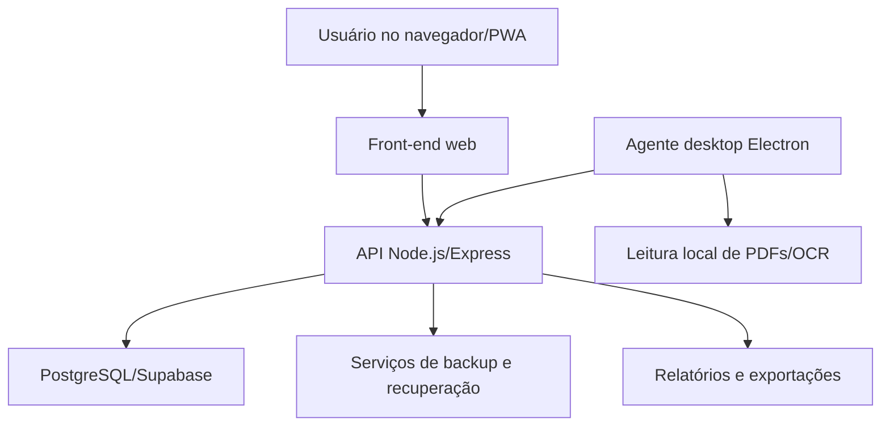

# BFA Almoxarifado - Sistema Full Stack para Gestão de Materiais


Sistema desenvolvido para controle de materiais e processos de almoxarifado na construção civil, com foco em estoque, entradas, saídas, requisições, ferramentas, notas fiscais, relatórios e automações.

## Sobre o projeto

O BFA Almoxarifado é um sistema full stack criado para organizar processos operacionais de almoxarifado em obras. O projeto centraliza registros de materiais, requisições, ferramentas, notas fiscais e relatórios em uma aplicação web responsiva, com apoio de banco PostgreSQL/Supabase e agente desktop local com Electron.

Este repositório público é um estudo de caso profissional. O código-fonte principal permanece privado por conter dados, regras internas e integrações sensíveis.

## Problema que o sistema resolve

Em operações de almoxarifado, muitas informações acabam espalhadas em planilhas, mensagens, arquivos PDF e controles manuais. Isso dificulta acompanhar estoque, registrar entradas e saídas, controlar ferramentas, localizar notas fiscais e gerar relatórios confiáveis.

O sistema foi desenvolvido para reduzir retrabalho, melhorar rastreabilidade e tornar os processos mais rápidos e organizados.

## Principais funcionalidades

- Controle de estoque
- Entrada de materiais
- Saída de materiais
- Requisições internas
- Controle de ferramentas
- Empréstimos/devoluções
- Notas fiscais
- Leitura de PDFs/OCR
- Dashboard
- Relatórios
- Controle por obra
- Backup e recuperação de dados
- Sistema responsivo/PWA
- Agente desktop com Electron
- Integração com banco PostgreSQL/Supabase

## Tecnologias utilizadas

| Camada | Tecnologias |
| --- | --- |
| Front-end | HTML5, CSS3, JavaScript, PWA |
| Back-end | Node.js, Express.js, REST API |
| Banco de dados | PostgreSQL, Supabase |
| Desktop | Electron |
| Automação | OCR com Tesseract.js, leitura de PDFs com PDF.js |
| Arquivos e relatórios | SheetJS/XLSX, geração e leitura de documentos |
| Deploy | Render, Vercel, Railway |
| Versionamento | Git, GitHub |

## Arquitetura geral



## Módulos do sistema

- **Estoque:** cadastro, consulta e movimentação de materiais.
- **Entradas:** registro de recebimentos e atualização de saldo.
- **Saídas:** baixa de materiais vinculada a solicitações internas.
- **Requisições:** criação, acompanhamento e histórico de pedidos.
- **Ferramentas:** controle de empréstimos, devoluções e disponibilidade.
- **Notas fiscais:** apoio à leitura, organização e consulta de PDFs.
- **Dashboard:** visão resumida de indicadores operacionais.
- **Backup:** rotinas de exportação, recuperação e validação de dados.
- **Agente desktop:** integração local para automações com Electron.

## Diferenciais técnicos

- Sistema construído a partir de um problema real de operação.
- Integração entre aplicação web, API, banco de dados e agente desktop.
- Uso de OCR e leitura de PDFs para reduzir tarefas manuais.
- Estrutura com rotinas de backup, restauração e validação.
- Aplicação responsiva com suporte a uso como PWA.
- Evolução incremental com versionamento e documentação técnica.

## Prints ou imagens demonstrativas

Os prints públicos ainda não foram adicionados. Qualquer imagem incluída neste repositório deve estar tratada e conter apenas dados fictícios, sem nomes reais de obras, empresas, fornecedores, usuários, notas fiscais ou informações internas.

Pasta sugerida para imagens públicas:

```txt
assets/screenshots/
```

## Status do projeto

Projeto privado em evolução, utilizado como base de aprendizado prático em desenvolvimento full stack, automação, banco de dados e organização de processos.

## Observação de privacidade

Este projeto possui código-fonte privado por conter informações internas, dados operacionais e integrações sensíveis. Este repositório apresenta apenas a documentação técnica, estudo de caso, funcionalidades, tecnologias utilizadas e demonstrações visuais sem dados reais.

## O que aprendi desenvolvendo o projeto

- Estruturar uma aplicação full stack com front-end, back-end e banco de dados.
- Criar APIs REST para processos reais de estoque, requisições e ferramentas.
- Trabalhar com persistência, migração e recuperação de dados.
- Integrar PostgreSQL/Supabase em um sistema operacional.
- Automatizar leitura de documentos com OCR e processamento de PDFs.
- Pensar em privacidade, segurança e separação entre código privado e apresentação pública.
- Documentar um projeto real de forma clara para portfólio e recrutadores.
