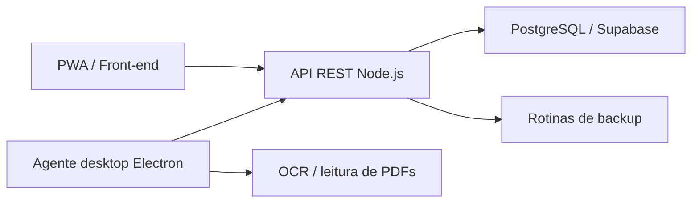

# Arquitetura geral

Este documento resume a arquitetura pública do BFA Almoxarifado sem expor código-fonte, dados internos ou integrações sensíveis.

## Visão macro

## Componentes

| Componente | Responsabilidade |
| --- | --- |
| Front-end web/PWA | Interface de estoque, requisições, ferramentas, notas e relatórios |
| API REST | Regras de negócio, validações e integração com persistência |
| PostgreSQL/Supabase | Armazenamento estruturado dos dados operacionais |
| Electron | Agente local para automações no desktop |
| OCR/PDF | Apoio à leitura e organização de documentos |
| Backup | Exportação, validação e recuperação controlada de dados |

## Observação

A arquitetura publicada aqui é intencionalmente resumida. Detalhes de banco, rotas internas, chaves, dados reais e regras específicas do negócio permanecem fora do repositório público.
